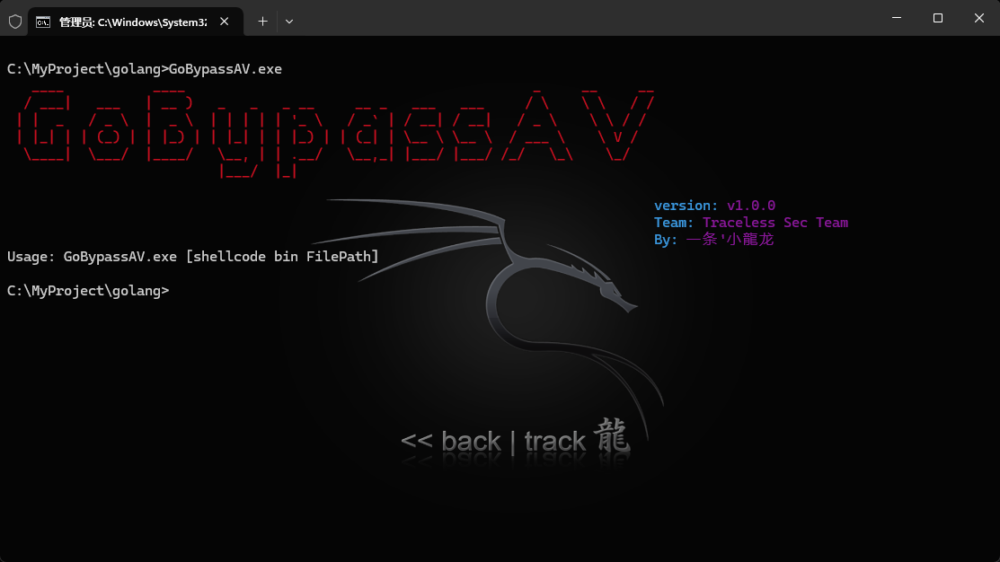
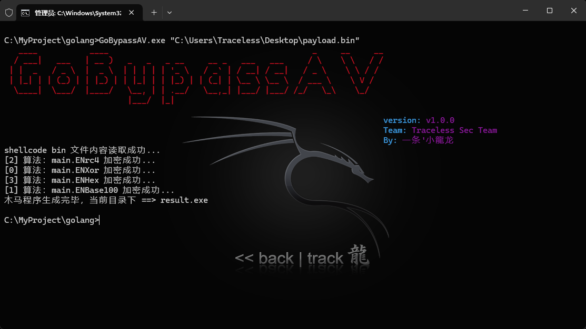

# GoBypassAV


## 项目介绍

GoBypassAV 是一款针对红队渗透测试过程中，Bypass 杀软的一款工具。
仅供学习使用！切勿用于非法用途！

## 免杀能力
目前360和defender动静态免杀

## 参数说明

```shell
GoBypassAV.exe [shellcode bin FilePath]
```

## 环境部署

1.部署本地Golang环境

2.设置go env

```
cmd /c go env -w GOARCH=amd64
```

2.首次使用，会自动下载相关依赖

<span style="color:red">PS：</span>`go.mod`和`go.sum`不要删除！

## 测试上线准备工作

重要的事情说三遍！

1.本地测试

`关闭杀软自动上传样本功能！`

`关闭杀软自动上传样本功能！`

`关闭杀软自动上传样本功能！`

2.请不要上传至VT或微步等云查杀平台检测！

## 程序截图





## 附美女照片


